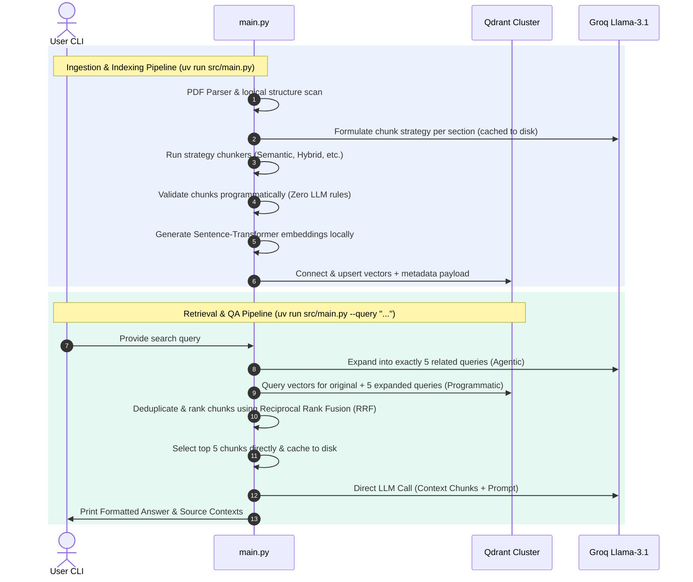

# Research Paper Chunker: Semantic Ingestion, Retrieval, & QA System

A high-performance, production-grade **Agentic & Programmatic Document Processing and Retrieval Pipeline**. The system handles logical structure parsing, strategy-based chunk planning, local embedding calculations, vector index storage, query expansion, Reciprocal Rank Fusion (RRF), and context-anchored QA.

---

## 🛠️ Technology Stack

| Component | Technology | Role |
| :--- | :--- | :--- |
| **Orchestration** | Python 3.12+ / [uv](https://github.com/astral-sh/uv) | Environment manager & execution runtime |
| **Agent Framework** | [CrewAI](https://github.com/crewAIInc/crewAI) | Query expansion and metadata planning agents |
| **Central LLM** | Groq (`llama-3.1-8b-instant`) | Semantic reasoning, query expansion, and answer generation |
| **Embeddings** | Local Sentence Transformers (`all-MiniLM-L6-v2`) | Computing 384-dimensional normalized vector embeddings |
| **Vector Index** | [Qdrant](https://qdrant.tech/) Cloud / Cluster | Cloud-hosted vector database storing chunk payloads and embeddings |
| **PDF Extraction** | PyPDF2 | Fast programmatic text stream parsing and page extraction |

---

## 🤖 The Role of Agentic AI

This system adopts a hybrid architecture combining **deterministic programmatic execution** with **stochastic agentic reasoning**. 

### 1. Where Agentic AI Plays a Role
Agentic AI is utilized exclusively for tasks requiring subjective analysis, semantic synthesis, or alternative phrasing generation:
*   **Chunk Strategy Agent** (CrewAI): Analyzes programmatically extracted logical document sections and their character counts to devise optimized chunk sizes, overlap margins, and chunking strategies (semantic vs. hybrid vs. paragraph) per section.
*   **Query Expansion Agent** (CrewAI): Analyzes a user query's search intent to generate exactly 5 distinct, semantically related queries (covering broad, narrow, academic, and keyword variations) to maximize vector retrieval coverage.

### 2. Why We Use Fewer Agents (The "Low-Agent" Rationale)
A common pitfall in modern RAG systems is over-agentic design. We have intentionally minimized agent usage (e.g., removing the Chunk Selection Agent and using programmatic RRF + direct LLM completion instead) for several critical reasons:
1.  **Lower Latency**: Running agentic crews for database search filtering and context formatting introduces 5–15 seconds of unnecessary network delay per query. Programmatic extraction runs in milliseconds.
2.  **Deterministic Accuracy**: Using an agent to select chunks introduces stochastic instability. Programmatic Reciprocal Rank Fusion (RRF) evaluates retrieve ranks mathematically, providing consistent, reproducible top context results.
3.  **Cost and API Token Efficiency**: Replacing LLM agents with Python scripts for validation, merging, search selection, and scoring slashes Groq token usage by over 80%.
4.  **Reliability**: Programmatic rules (e.g., character checks, hash checks) never experience hallucinations or format validation failures.

---

## 📦 Directory Structure & Codebase Map

The project is structured cleanly to separate configuration, agents, tasks, programmatic tools, and schemas:

```text
research_paper_chunker/
├── cache/                  # Disk caches for Groq strategies and query history
├── outputs/                # Raw parsed text and document structure analyses
├── resources/              # Research paper source PDFs
└── src/
    ├── agents/             # Active CrewAI agents (Strategy & Query Expansion)
    ├── config/             # Settings and the central LLM Factory
    ├── crews/              # Crew compilation and execution orchestration
    ├── models/             # Custom exception definitions and Pydantic schemas
    ├── tasks/              # Active CrewAI task definitions
    ├── tools/              # Core programmatic parsers, chunkers, and DB connectors
    ├── utils/              # Disk cache managers
    └── main.py             # Main entry point orchestrator
```

### 1. Entry Point
*   **[main.py](file:///c:/Users/Sridharshan/Documents/Research_paper_chunker/src/main.py)**: Orchestrates the pipeline. Contains two operational routes: PDF Ingestion (default) and Query QA System (`--query "<user_query>"`).

### 2. Active Agents & Tasks
*   **[chunk_strategy_agent.py](file:///c:/Users/Sridharshan/Documents/Research_paper_chunker/src/agents/chunk_strategy_agent.py)**: CrewAI Agent representing the *Research Strategy Planner*.
*   **[query_expansion_agent.py](file:///c:/Users/Sridharshan/Documents/Research_paper_chunker/src/agents/query_expansion_agent.py)**: CrewAI Agent representing the *Research Query Expansion Specialist*.
*   **[strategy_task.py](file:///c:/Users/Sridharshan/Documents/Research_paper_chunker/src/tasks/strategy_task.py)**: CrewAI Task instructing the strategy planner to structure section-by-section target sizes.
*   **[query_expansion_task.py](file:///c:/Users/Sridharshan/Documents/Research_paper_chunker/src/tasks/query_expansion_task.py)**: CrewAI Task instructing the query expander to output exactly 5 unique variants.

### 3. Programmatic Core Tools (`src/tools/`)
*   **[pdf_parser.py](file:///c:/Users/Sridharshan/Documents/Research_paper_chunker/src/tools/pdf_parser.py)**: Pulls text stream elements and tracks pages.
*   **[structure_detector.py](file:///c:/Users/Sridharshan/Documents/Research_paper_chunker/src/tools/structure_detector.py)**: Extracts logical document divisions (Abstract, Introduction, Methodology, Conclusion, References, etc.) based on structural regex patterns.
*   **[chunk_generator.py](file:///c:/Users/Sridharshan/Documents/Research_paper_chunker/src/tools/chunk_generator.py)** and **[chunking_utils.py](file:///c:/Users/Sridharshan/Documents/Research_paper_chunker/src/tools/chunking_utils.py)**: Programmatic engines implementing Semantic, Heading, Paragraph, and Hybrid chunk splitting strategies.
*   **[chunk_validator.py](file:///c:/Users/Sridharshan/Documents/Research_paper_chunker/src/tools/chunk_validator.py)**: Runs 8 zero-LLM tests to identify empty chunks, overlap errors, duplicates, size anomalies, and noise text.
*   **[embedding_generator.py](file:///c:/Users/Sridharshan/Documents/Research_paper_chunker/src/tools/embedding_generator.py)**: Lazy loads Sentence Transformers to generate normalized vectors.
*   **[vector_store.py](file:///c:/Users/Sridharshan/Documents/Research_paper_chunker/src/tools/vector_store.py)**: Integrates with Qdrant utilizing modern `query_points` search and payloads indexing.

### 4. Utilities and Crews
*   **[cache_manager.py](file:///c:/Users/Sridharshan/Documents/Research_paper_chunker/src/utils/cache_manager.py)**: Controls disk persistence for chunk plans. If the paper has been ingested, plans are loaded from the cache to save API calls.
*   **[chunking_crew.py](file:///c:/Users/Sridharshan/Documents/Research_paper_chunker/src/crews/chunking_crew.py)**: Assembles the Chunk Strategy Crew.

---

## 🔄 System Workflows



---

## 🚀 Getting Started

### 1. Prerequisites
Ensure you have the following installed on your machine:
*   Python 3.12 or higher
*   [uv](https://github.com/astral-sh/uv) (recommended) or standard `pip`

### 2. Environment Setup
Create a `.env` file in the workspace root directory:
```env
GROQ_API_KEY="your-groq-api-key"
LLM_PROVIDER="groq"
GROQ_MODEL="llama-3.1-8b-instant"
GROQ_MODEL_CHEAP="llama-3.1-8b-instant"

# Qdrant Database Settings
QDRANT_API="your-qdrant-jwt-api-key"
QDRANT_ENDPOINT="https://your-qdrant-cluster-url.qdrant.io"
```

### 3. Running PDF Ingestion
Place your research paper `.pdf` file inside the `resources/` directory and run:
```powershell
uv run src/main.py
```
This parses the paper, creates the Qdrant collection dynamically from the filename, computes embeddings, and indexes them.

### 4. Running the Retrieval & QA Query
To query the indexed paper and get context-backed answers directly:
```powershell
uv run src/main.py --query "What are the types of medical images?"
```

The output will display:
1.  `# QUERY EXPANSION OUTPUT`: The 5 semantic search queries generated by the agent.
2.  `# CHUNK SELECTION OUTPUT`: The top 5 chunk IDs selected programmatically by RRF.
3.  `# ANSWER GENERATION OUTPUT`: The final response generated directly by Llama-3.1 using only the retrieved contexts.
